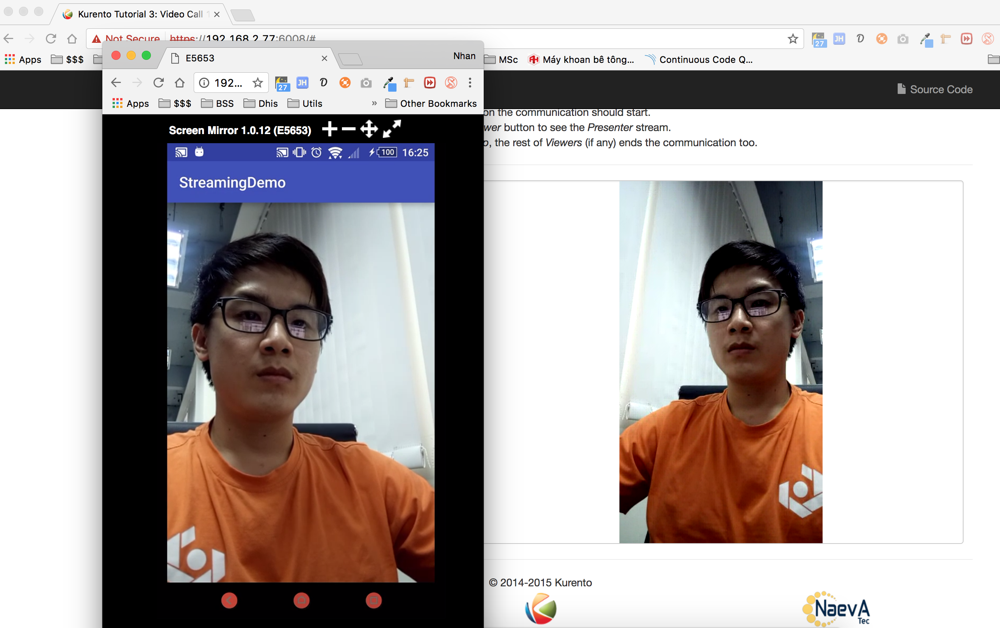

## Setup
1. Install server: https://www.youtube.com/watch?v=02X7HOyhAkA
2. Start server demo: https://www.youtube.com/watch?v=b44IKU2pl3U
3. Start app: https://www.youtube.com/watch?v=W407V5T_aW4

### Demo server
https://github.com/nhancv/ot-kurento-node-webrtc

### Kurento tutorial flow
http://doc-kurento.readthedocs.io/en/stable/

### Android webrtc-peer lib
https://github.com/nhancv/nc-android-webrtcpeer

